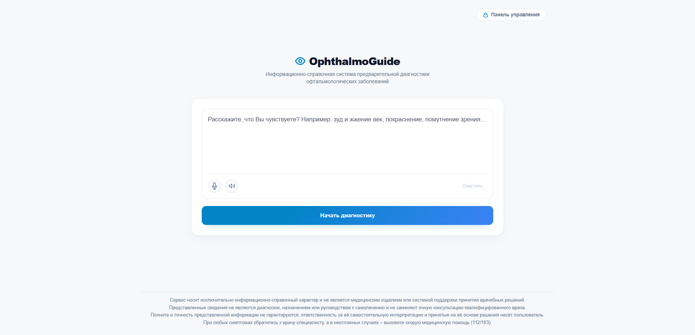
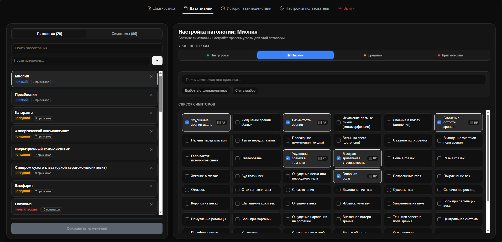

<p align="center">
  
</p>

# OphthalmoGuide

**Информационно-справочная система предварительной диагностики офтальмологических заболеваний**

<p align="center">
  
  
</p>

## Архитектура и компоненты проекта

Система спроектирована как многокомпонентная инфраструктура, разворачиваемая через Docker Compose:

### 1. Frontend (клиентское веб-приложение)
* **Стек:** Vue 3 (Vite, TypeScript), Angie
* **Функционал:**
  * Чат-интерфейс: пользователь описывает симптомы текстом, система формулирует предположения о возможных заболеваниях;
  * Панель администратора для управления базой знаний и анализа истории взаимодействий;
  * Интеграция с системой авторизации Authentik.

### 2. Backend (серверная часть)
* **Стек:** ASP.NET Core (.NET 10, C#), Entity Framework Core + Npgsql, CAP, QuestPDF, OpenTelemetry
* **Ключевые сервисы:**
  * **OphthalmologyService** – основное ядро бизнес-логики: управление базой знаний, отправка запросов к локальной большой языковой модели (LLM) для извлечения симптомов, расчет соответствия симптомов заболеваниям (с учетом критических признаков) и ведение истории сессий;
  * **OidcAuthService** – интеграция с протоколом OpenID Connect на базе Authentik для безопасной авторизации;
  * **OllamaQueueBroker** – брокер очереди запросов к LLM для обработки вопросов пользователей без перегрузки системы;
  * **SaluteSpeechService** – интеграция с API SaluteSpeech для распознавания голоса и синтеза речи;
  * **PdfExportService** – генерация PDF-отчётов по результатам диагностики;
  * **KnowledgeJsonValidator** – статический валидатор для проверки корректности структуры и целостности данных в JSON-файле базы знаний (`ophthalmology_knowledge.json`);
  * **ValkeySeeder** – утилита начальной загрузки данных в кэш Valkey (выполняет предварительную проверку структуры через `KnowledgeJsonValidator`).

### 3. Bot-WorkerService (интеграция с платформами чат-ботов ВКонтакте и Telegram)
* **Стек:** .NET Worker Service (.NET 10, C#), Telegram.Bot, VkNet
* **Компоненты:**
  * **TelegramBotService** – чат-бот в Telegram: пользователь описывает симптомы, бот возвращает предположения о заболеваниях;
  * **VkBotService** – аналогичный функционал для ВКонтакте.

### 4. Инфраструктурные сервисы
* **PostgreSQL** – основная реляционная СУБД для хранения истории диагностики и системных логов;
* **Valkey** – высокопроизводительное in-memory хранилище (форк Redis) для кэширования сессий, данных, распределённых блокировок и обмена сообщениями;
* **Ollama (LLM)** – локальный ИИ-ассистент (модель `qwen3.5:4b-q4_K_M`), используемый для обработки естественного текста жалоб и извлечения из них клинических симптомов;
* **Authentik** – система управления доступом (IdP/SSO) для безопасной аутентификации пользователей;
* **DBX** – легкий веб-интерфейс для администрирования баз данных и хранилищ.

### 5. Мониторинг
* **Prometheus** – сбор и хранение метрик со всех ключевых компонентов системы;
* **cAdvisor** – сбор метрик ресурсов контейнеров;
* **redis-exporter** – экспорт метрик хранилища Valkey для Prometheus;
* **postgres-exporter** – экспорт метрик PostgreSQL для Prometheus;
* **Loki** – система агрегации логов контейнеров;
* **Promtail** – агент сбора логов Docker-контейнеров;
* **Grafana** – визуализация метрик и логов.

---

## Быстрый запуск

### Требования
* Docker и Docker Compose (с поддержкой NVIDIA Container Toolkit для использования GPU при работе с Ollama, если применимо).

### Инструкция
1. Скопируйте файл конфигурации окружения:
   ```bash
   cp .env.example .env
   ```
2. Настройте необходимые переменные окружения в `.env` (включая ключи для SaluteSpeech, Authentik и параметры БД).
3. Запустите инфраструктуру и сервисы в фоне:
   ```bash
   docker compose up -d --build
   ```

### Доступ к сервисам и первоначальная настройка

После успешного развертывания контейнеров сервисы доступны по следующим адресам:

#### 1. Пользовательские и административные интерфейсы:
* **Интерфейс пользователя (чат/диагностика):** `https://localhost` (или значение `PUBLIC_HOST` из `.env`);
* **Панель администратора:** `https://localhost/admin` (для входа требуется авторизация через Authentik);
* **Панель мониторинга (Grafana):** `https://localhost/grafana/` (интегрирована с Authentik через OAuth).

#### 2. Инфраструктура и базы данных:
* **Панель управления доступом (Authentik):** `https://localhost:9443/`;
* **Интерфейс управления базой данных (DBX):** `http://localhost:4224` (доступ к PostgreSQL и Valkey).

---

**Дисклеймер:** Сервис носит исключительно информационно-справочный характер и не является медицинским изделием или системой поддержки принятия врачебных решений. Представленные сведения не являются диагнозом, назначением или руководством к самолечению и не заменяют очную консультацию квалифицированного врача. Полнота и точность представленной информации не гарантируются; ответственность за её самостоятельную интерпретацию и принятые на её основе решения несёт пользователь. При любых симптомах обратитесь к врачу-специалисту, а в неотложных случаях – вызовите скорую медицинскую помощь (112/103).